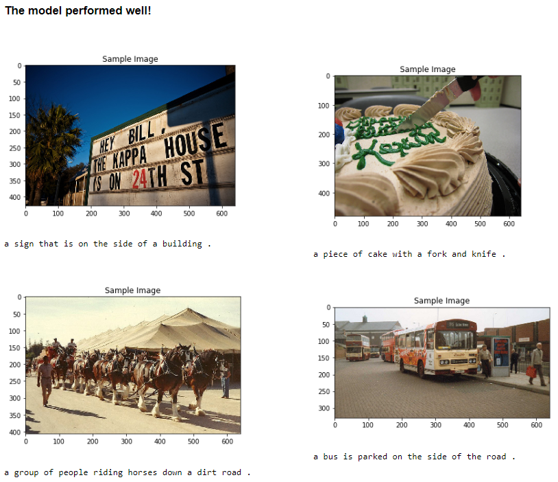
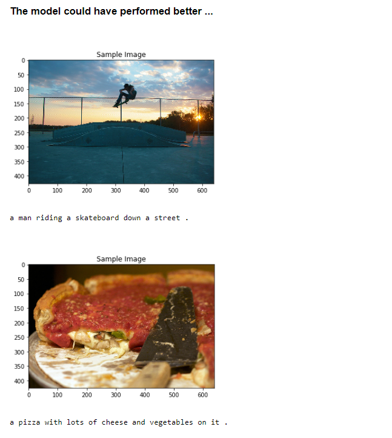

# Image Captioning

## Project Overview

The goal of image captioning is to convert a given input image into a natural language description. The encoder-decoder framework is widely used for this task. The image encoder is a convolutional neural network (CNN). In this Project, we used resnet50 model pretrained on the imagenet dataset. The decoder is a long short-term memory (LSTM) network. Here we will be using the MS-COCO dataset. 

#### Training phase
For the encoder part, the pretrained CNN extracts the feature vector from a given input image. The feature vector is linearly transformed to have the same dimension as the input dimension of the LSTM network. For the decoder part, source and target texts are predefined. For example, if the image description is **"Giraffes standing next to each other"**, the source sequence is a list containing **['\<start\>', 'Giraffes', 'standing', 'next', 'to', 'each', 'other']** and the target sequence is a list containing **['Giraffes', 'standing', 'next', 'to', 'each', 'other', '\<end\>']**. Using these source and target sequences and the feature vector, the LSTM decoder is trained as a language model conditioned on the feature vector.

#### Test phase
In the test phase, the encoder part is almost same as the training phase. The only difference is that batchnorm layer uses moving average and variance instead of mini-batch statistics. This can be easily implemented using [encoder.eval()](https://github.com/yunjey/pytorch-tutorial/blob/master/tutorials/03-advanced/image_captioning/sample.py#L37). For the decoder part, there is a significant difference between the training phase and the test phase. In the test phase, the LSTM decoder can't see the image description. To deal with this problem, the LSTM decoder feeds back the previosly generated word to the next input. This can be implemented using a [for-loop](https://github.com/yunjey/pytorch-tutorial/blob/master/tutorials/03-advanced/image_captioning/model.py#L48).

## Results

#### Future Work
The model which we saw above was just the tip of the iceberg. There has been a lot of research done on this topic. Currently, the state-of-the-art model in image captioning is Microsoft’s CaptionBot. You can look at a demo of the system on their official website (link : www.captionbot.ai).

I will list down a few ideas which you can use to build a better image captioning model.

<li>Adding in more data – Of course,  this is the usual tendency of a Deep Learning model. More data you provide to your model, the better it will perform. You can refer to this resource for other image captioning datasets – – http://www.cs.toronto.edu/~fidler/slides/2017/CSC2539/Kaustav_slides.pdf<\li>
<li>Using Attention models – As we saw in this article (Essentials of Deep Learning – Sequence to Sequence modelling with Attention), using attention models help us in fine tuning our model performance.<\li>
<li>Moving on to bigger and better techniques – There are a few techniques which researchers have been investigating – such as using reinforcement learning for building end-to-end deep learning systems, or using novel attention model for visual sentinel.<\li>
